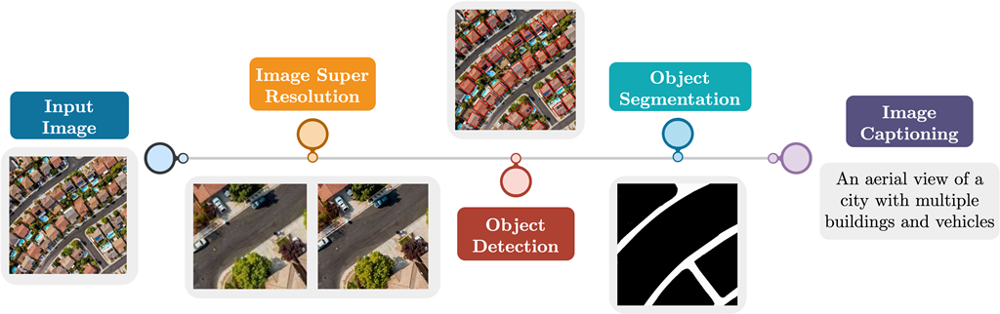

# GIS_hackathon
GIS hackathon 
__Team Name__: __Team Name__: Team Rocket

**Team Members**:
- Amit Sharma
-  Abhiroop Talasila
- Suvadeep Maiti
- Shivam Sharma
- Ekansh Chauhan

# Project Pipeline



## Code Structure

The code is structured as follows:

```

├── README.md
├── Code
│   ├── Road_extraction_using_K_Means_clustering_.ipynb
│   ├── image_dilation_and_erosion.ipynb
│   ├── reference_image.ipynb
├── images

```
